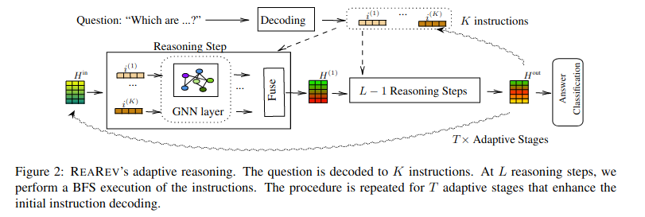

# ReaRev [EMNLP 2022]
This is the code for the EMNLP 2022 Findings paper: [ReaRev: Adaptive Reasoning for Question Answering over Knowledge
Graphs](https://arxiv.org/abs/2210.13650).

[](https://paperswithcode.com/sota/semantic-parsing-on-webquestionssp?p=rearev-adaptive-reasoning-for-question)

## Overview 
Our methods improves instruction decoding and execution for KGQA via adaptive reasoning, as shown:




## Get Started
We have simple requirements in `requirements.txt'. You can always check if you can run the code immediately.

We use the pre-processed data from: https://drive.google.com/drive/folders/1qRXeuoL-ArQY7pJFnMpNnBu0G-cOz6xv
Download it and extract it to a folder named "data".

__Acknowledgements__: 

[NSM](https://github.com/RichardHGL/WSDM2021_NSM): Datasets (webqsp, CWQ, MetaQA) / Code.

[GraftNet](https://github.com/haitian-sun/GraftNet): Datasets (webqsp incomplete, MetaQA) / Code.

## Training

To run Webqsp:
```
python main.py ReaRev --entity_dim 50 --num_epoch 200 --batch_size 8 --eval_every 2 \ 
--data_folder data/webqsp/ --lm sbert --num_iter 3 --num_ins 2 --num_gnn 2 \
--relation_word_emb True --experiment_name Webqsp322 --name webqsp
```

To run CWQ:
```
python main.py ReaRev --entity_dim 50 --num_epoch 100 --batch_size 8 --eval_every 2 \
--data_folder data/CWQ/ --lm sbert --num_iter 2 --num_ins 3 --num_gnn 3 \
--relation_word_emb True --experiment_name CWQ --name cwq
```
To run MetaQA-3:
```
python main.py ReaRev --entity_dim 50 --num_epoch 10 --batch_size 8 --eval_every 2  \
--data_folder data/metaqa-3hop/  --lm lstm --num_iter 2 --num_ins 3 --num_gnn 3  \
--relation_word_emb False --experiment_name metaqa3 --name metaqa 
```

For incomplete Webqsp, see  'data/incomplete/' (after obtaining them by [GraftNet](https://github.com/haitian-sun/GraftNet)). If you cannot afford a lot of memory for CWQ, use the '--data_eff' argument (see our arguments in `parsing.py').

## Results

We also provide some pretrained ReaRev models (ReaRev_webqsp.ckpt, ReaRev_webqsp_v2.ckpt, ReaRev_CWQ.ckpt). You can download them from [here](https://drive.google.com/file/d/1p7eLSsSKkZQxB32mT5lMsthVP6R_3x1j/view?usp=share_link). Please extract them to a folder `checkpoint/pretrain/'.

To reproduce Webqsp results, run:
```
python main.py ReaRev --entity_dim 50 --num_epoch 200 --batch_size 8 --eval_every 2 --data_folder data/webqsp/ --lm sbert --num_iter 3 --num_ins 2 --num_gnn 3 --relation_word_emb True --load_experiment ReaRev_webqsp.ckpt --is_eval --name webqsp
```
or
```
python main.py ReaRev --entity_dim 50 --num_epoch 200 --batch_size 8 --eval_every 2 --data_folder data/webqsp/ --lm sbert --num_iter 3 --num_ins 2 --num_gnn 2 --relation_word_emb True --load_experiment ReaRev_webqsp_v2.ckpt --is_eval --name webqsp
```

To reproduce CWQ results, run:
```
python main.py ReaRev --entity_dim 50 --num_epoch 100 --batch_size 8 --eval_every 2 --data_folder .data/CWQ/ --lm sbert --num_iter 2 --num_ins 3 --num_gnn 3 --relation_word_emb True --load_experiment ReaRev_CWQ.ckpt --is_eval --name cwq
```

|Models | Webqsp| CWQ | MetaQA-3hop|
|:---:|:---:|:---:|:---:|
|KV-Mem| 46.7 | 21.1| 48.9 |
|GraftNet| 66.4 | 32.8 |77.7 |
|PullNet| 68.1 |  45.9 | 91.4| 
|NSM-distill| 74.3 | 48.8 | **98.9** |
|ReaRev| **76.4** | **52.9** | **98.9** |

## Cite
If you find our code or method useful, please cite our work as
```
@article{mavromatis2022rearev,
  title={ReaRev: Adaptive Reasoning for Question Answering over Knowledge Graphs},
  author={Mavromatis, Costas and Karypis, George},
  journal={arXiv preprint arXiv:2210.13650},
  year={2022}
}
```
